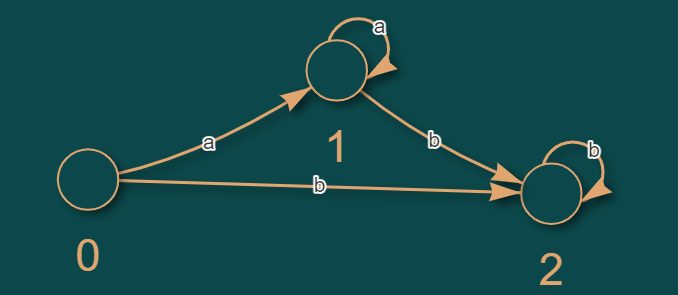
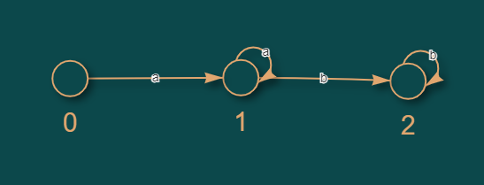

# Gramaticas-de-lenguajes
Programas de Python para interpretar diferentes gramaticas

 

---------
# Diagrama de estados de automatas 

Imágen 2. Diagrama de estados finitos para el autómata de la grámatica 2.

 

Imágen 3. Diagrama de estados finitos para el autómata de la grámatica 3.

 

Imágen 4. Diagrama de estados finitos para el autómata de la grámatica 4.

 

Imágen 5. Diagrama de estados finitos para el autómata de la grámatica 5.

 

## Miembros del grupo

- Laura González
- Camilo Madero
- Paula Páez
- Felipe Rodriguez