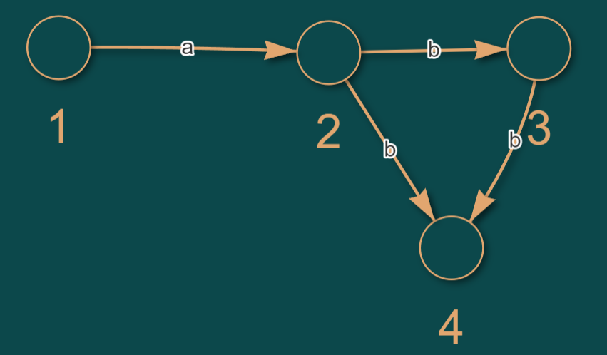
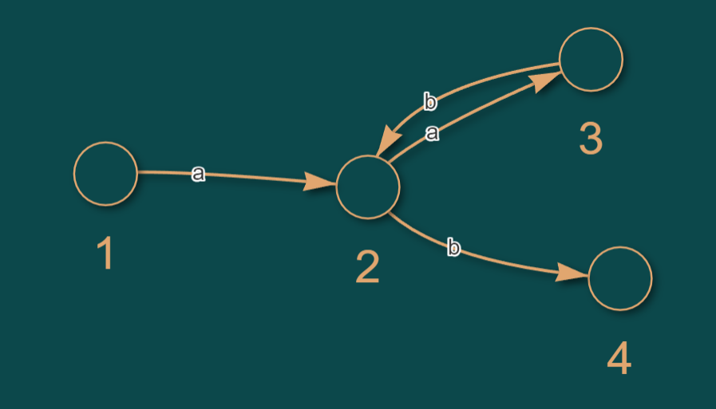

# Gramaticas-de-lenguajes
Programas de Python para interpretar diferentes gramaticas

 

---------
# Diagrama de estados de automatas 

Imágen 4. Diagrama de estados finitos para el autómata de la grámatica 4.

 

Imágen 5. Diagrama de estados finitos para el autómata de la grámatica 5.

